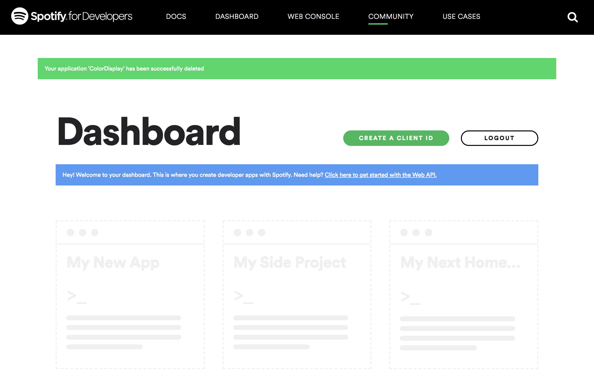
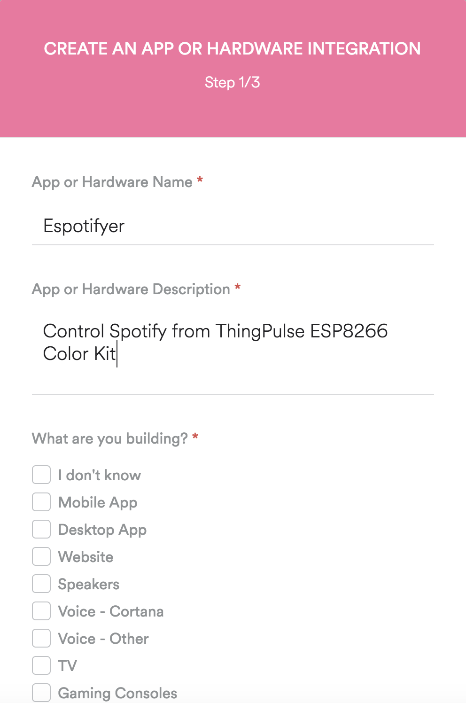
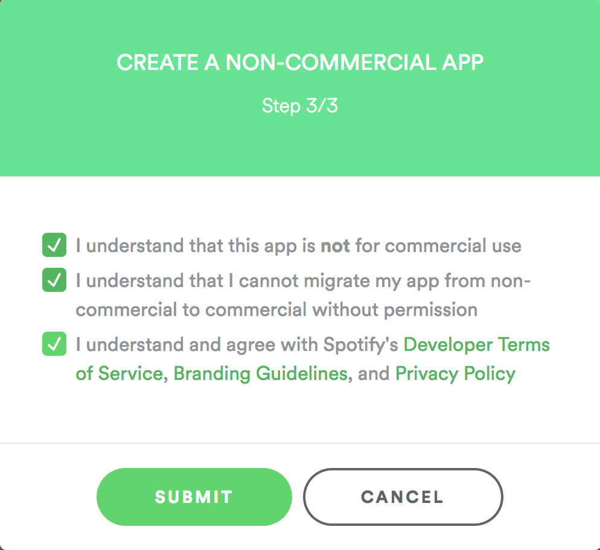
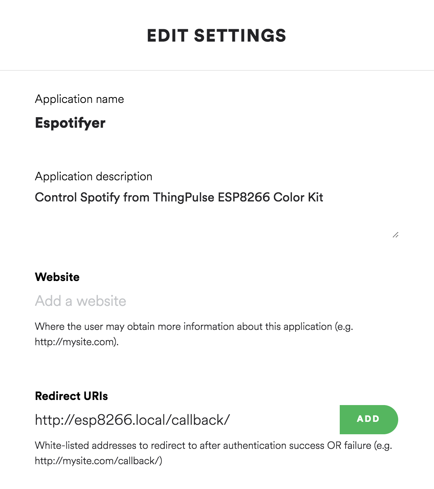
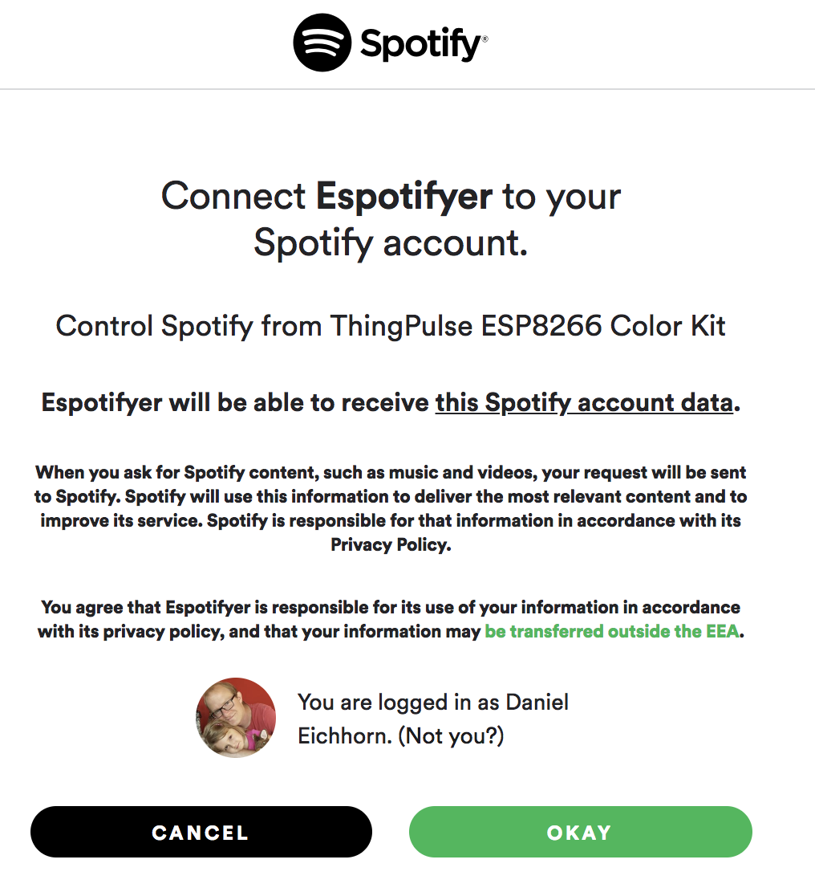

# ThingPulse esp8266-spotify-remote

## Purpose of this project

This project lets you control a Spotify player (phone, browser, etc) from an ESP8266. Album artworks as well as title and artist name
are fetched from Spotify's Web API over WiFi and displayed on a ILI9341 color TFT screen. The currently played song can be
paused, played and skipped to the next or previous song in the playlist.

A full OAuth 2.0 web flow is used to acquire the necessary access and refresh tokens to permit the user to control the player. In order to
run this project on your device you will have to setup an application on Spotify's developer dashboard.

## Features

 - Artwork Download
 - Control Player on touch screen: Play, Pause, Next, Prev
 - Authentication and Authorization (OAuth 2.0 flow) On device.

Demo Video:

 

## Recommended Hardware

We developed this project specifically for our [ESP8266 Color Kit](https://thingpulse.com/product/esp8266-wifi-color-display-kit-2-4/). If you appreciate the hard work and our willingness to open-source projects like this one then please support us by buying our hardware.

## Contributions

Please see our [Guidelines](CONTRIBUTING.md) if you want to contribute to this project. Contributions are more than welcome!

## Service level promise

<table><tr><td>
</td><td>This is a ThingPulse <em>community</em> project. See our <a href="https://thingpulse.com/about/open-source-commitment/">open-source commitment declaration</a> for what this means.</td></tr></table>

## Setup Instructions

### Precondition

The below instructions assume that your Arduino IDE is properly setup to work with the ThingPulse Color Kit. See our standalone tutorials for [setting up the IDE](https://docs.thingpulse.com/how-tos/Arduino-IDE-for-ESP8266/) and [installing the drivers](https://docs.thingpulse.com/how-tos/install-drivers/) if you need help with that.

### Prepare Project in Arduino IDE

1. Download this project either as ZIP file or check it out with Git
1. Open the project in the Arduino IDE.
1. Install the required Arduino libraries. Go to Sketch > Include Library... > Manage Libraries.... Then, for each library, put its name into the text field to have its metadata pulled from the internet and displayed below. Select the latest version and install it.
	1. [Mini Grafx](https://www.arduinolibraries.info/libraries/mini-grafx) library (by Daniel Eichhorn, V 1.0.0 or later)
	1. [JPEGDecoder](https://www.arduinolibraries.info/libraries/jpeg-decoder) library (by Bodmer, Makoto Kurauchi, Rich Geldreich, v1.7.8 or later). After installing the library go to your Arduino sketchbook folder (the one configured in Arduino Preferences > Sketchbook location). In that folder open file `libraries/JPEGDecoder/src/User_config.h` and comment line 5 so that it reads `//#define LOAD_SD_LIBRARY`.
	1. [JSON Streaming Parser](https://www.arduinolibraries.info/libraries/json-streaming-parser) library (by Daniel Eichhorn, v1.0.5 or later)
	1. [XPT2046_Touchscreen](https://www.arduinolibraries.info/libraries/xpt2046_touchscreen) (by Paul Stoffregen, v1.2.0 or later)
1. Set your *WiFi credentials* in the `settings.h` file
1. Complete the steps below to get the values for the *Spotify settings* required in `settings.h`

### Get Access to the Spotify API

1. Go to [https://developer.spotify.com/dashboard/login](https://developer.spotify.com/dashboard/login) and login to or sign up for the Spotify Developer Dashboard

2. Click on "My New App"

3. Fill out the form. Give your new app a name you can attribute to this project. It's safe to select "I don't know" for the type of application.

4. At the end of the 3 steps click "Submit"

5. Set the unique Client ID and Client Secret as values for the respective variables in `settings.h`

6. Click on "Edit Settings". Add "http://esp8266.local/callback/" to the Redirect URIs section.

   **NOTE** If you're running more than ThingPulse Spotify Remote in the same WiFi network you should choose a unique name rather than "esp8266". Regardless of what you choose it has to reflect what you set as `espotifierNodeName` in `settings.h`

7. Don't forget to save your settings.

### Compile and run the application

After all this configuration it's about time to run the application!

1. First check the configuration in `settings.h` one more time to ensure the Spotify values match those set on the Spotify Developer Dashboard. Better safe than sorry, they say.

2. Attach your [ESP8266 Color Kit](https://thingpulse.com/product/esp8266-wifi-color-display-kit-2-4/) to your computer and select the correct serial port and flash settings in the Arduino IDE as per https://docs.thingpulse.com/guides/wifi-color-display-kit/#select-flash-mode-and-flash-size

3. Upload the code to your ESP8266

4. When you run this the first time you'll have to go through additional steps. The display will ask you to open the browser at a specific location. This will redirect you to the dialog below.

5. The next step is to calibrate the screen. Click on the white circles

6. Now open your Spotify player and start a song. If everything worked out you'll see the song information with artwork on the TFT screen!
